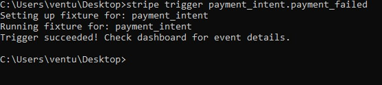

# How to setup the Stripe CLI to test Checkout errors locally

1. The first thing you need to do is download the Stripe CLI from this link: https://github.com/stripe/stripe-cli/releases/tag/v1.13.8
2. Unzip the file and open a command prompt and cd into whatever directory you placed it in. 
3. From the command prompt type in : stripe login, you should get a message like this: 
Press enter and login with your stripe credentials. 

4. You can now directly trigger failure requests like so:
If you head over to your Stripe account dashboard, you should be able to see the failure there: 
5. You can also start forwarding stripe error requests to whatever endpoint you have setup. Currently our endpoint is called "webhook" this is how we can start forwarding those requests:   
6. On our checkout page I just entered a card with insufficient funds which will trigger an error, we can see that in CLI: 
We can also put in a breakpoint in our app to see that the requests are being successfully forwarded: 