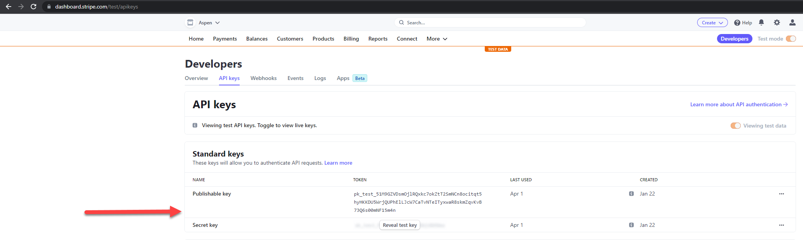

# Stripe Account Setup Process

### 1. Creating a Stripe Account 
- Go to the Stripe website at stripe.com and create a stripe business account. 
- After you enter all of your information go to the "Developers" tab and click on API keys and you will see 2 keys here that will be used in the app: 

### 2. Customizing your Stripe Checkout Form
- Click on the settings icon in the far right of the page and click on the Branding option in Business Settings

- Once you're there you can customize your receipts and checkout page to match the look of your website. 

### 3. Setting Up Webhook used to detect checkout errors
- Go to your stripe account and click on the developers tab, then Webhooks, and click add Endpoint:

- You should get to this page, Fill out the url for your website and click on "select events"

After clicking on select events, Add this one here and at the bottom of the page click "add events", you will notice that it gives sample code in the right hand side, you can just ignore this code, don't do anything with it. The app already has this. 

- Once redirected pack the webhook page, click on your new endpoint and keep track of the signing secret because it will be used later. 

### 4. Placing Stripe Keys in Application 
- Navigate to the file called StripeContainer.tsx and change the PUBLIC_KEY variable to your public key value in your account: 

- We are using GitHub To store our API keys, so you simply need to add variables in the settings of your repo. 

- Add 2 secrets, They need to have these exact names: STRIPE___SECRETKEY, and WEBHOOK_SECRET
- Copy the values from your stripe account into the Secret field here: 

- This is an example of setting the STRIPE___SECRETKEY variable, now just repeat for the webhook secret. 